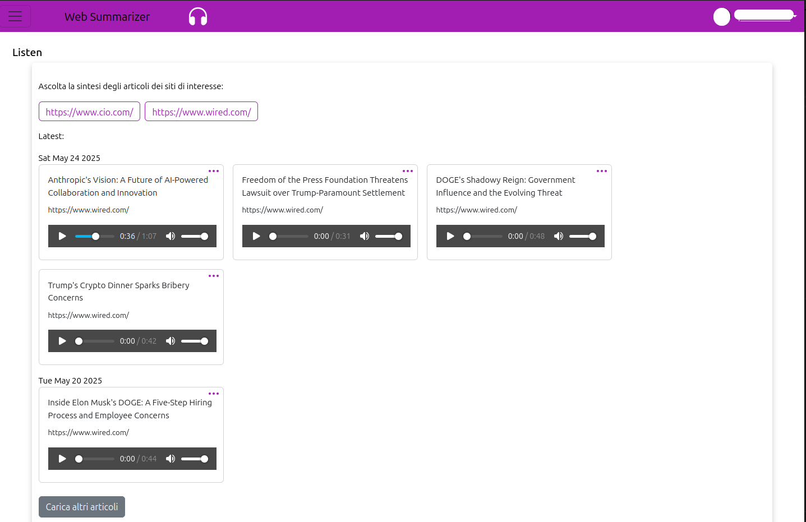

# Web Summary
Summarize and create audio of a list of websites to stay updated on the news.

The idea started with the need to stay updated on a list of Information Technology websites,
the aim is to reduce the time to surf periodically this websites to read news giving this job to AI.

It's a very easy flow:
* websites of interest are scanned for new articles every day;
* a short summary is generated with LLM;
* then the text is converted into audio (so that I can listen to it when I'm in the car);


Listen



## How to run it

Pre-requisites:
* docker
* python
* python virtual environment (My recommendation is conda https://docs.conda.io/projects/conda/en/latest/index.html)
* npm

<br>

### 1. Start the dabase using docker

```
docker compose -p websummary up -d
```
<br>

### 2. Setup the Libs python package

* Go in the `Backend.Libs` folder > `cd Backend/Libs`
* Create a conda virtual environment
```
conda create -p venv python=3.10
conda activate ./venv
pip install -r requirements.txt
```
* Now we create the python package from the sub-folder `package_auth`
```
cd Backend/Libs/package_auth
pip install -e .
```
<br>

### 3. Start the python backend api service

* Go in the `Backend.Scraper` folder > `cd Backend/Scraper`
* Setup the conda virtual environment
```
conda create -p venv python=3.10
conda activate ./venv
pip install -r requirements.txt
```
* Create a `.env` file and fill the empty keys
```
LANG_SMITH=""
GROQ_API_KEY=""
USER_AGENT="Mozilla/5.0 (X11; Ubuntu; Linux x86_64; rv:15.0) Gecko/20100101 Firefox/15.0.1"
```

* Configure client_id and client_secret for Google Auth
  * https://console.developers.google.com/auth/clients
  * set the Authorized redirect URIs: http://localhost:3000/logingoogle
  * Save and note the ClientID and ClientSecret
  * Change the `src/config/config.py` setting there `auth_provider_google_client_id` and `auth_provider_google_client_secret`

* now install the local python Libs package
```
cd ../Libs/package_auth
pip install -e .
```
* Finally, start the Api `python ./src/main.py`

<br>

### 4. Start the UI that is in React

* Open the `config.js` file and setup the keys
  * Setup the `LOGIN_GOOGLE_URL` you need to change the `client_id` query parameter there, so find and replace the `client_id` with the Google client_id that has been setup in python
  * Setup the `GOOGLE_ANALYTICS_ID` using https://analytics.google.com/analytics/web/
  * Setup the `RECAPTCHA_SITE_KEY` using https://www.google.com/recaptcha/admin
* Run it `npm start`
